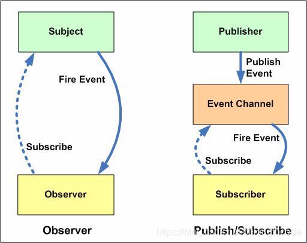

**监听器模式**

### 监听器模式/观察者模式

| **监听**   | **观察者模式** |
| ---------- | -------------- |
| 事件源     | 主题           |
| 事件对象   |                |
| 事件监听器 | 观察者         |

​                                    

**作用：**                                             

监听器监听事件源一举一动：

当事件源的某个事情触发的时候就会被监听器监听到从而触发某个事情

**实现：**

问题在于监听器是如何知道事件源被触发，

这是事件源被调用时候 事件源本身自己最清楚  监听器只能在事件源上组合